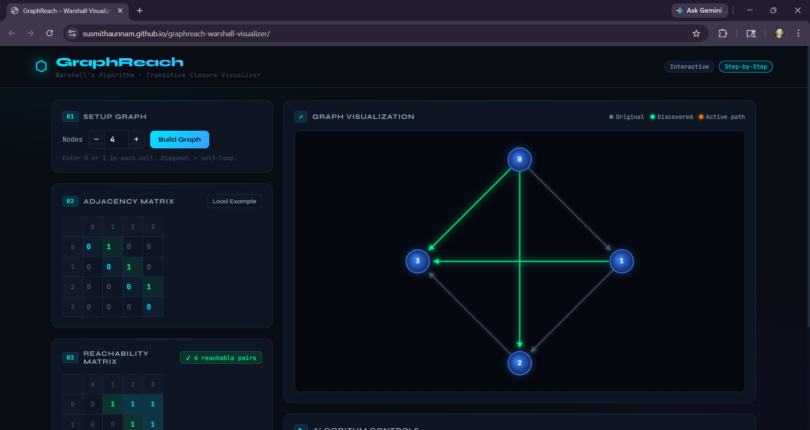

# GraphReach – Warshall Visualizer

An interactive web-based tool to visualize **Warshall’s Algorithm** for computing transitive closure in directed graphs.

---

## 🚀 Features

* Interactive graph visualization
* Step-by-step execution of Warshall’s Algorithm
* Intermediate node tracking (k iterations)
* Path discovery logs
* Final reachability matrix output

---

## 🖼️ Preview

---

## ⚙️ Tech Stack

* HTML
* CSS
* JavaScript

---

## 🎯 Use Cases

* Learning graph algorithms
* Understanding transitive closure
* Academic demonstrations

## 👨‍💻 Author
Susmitha
